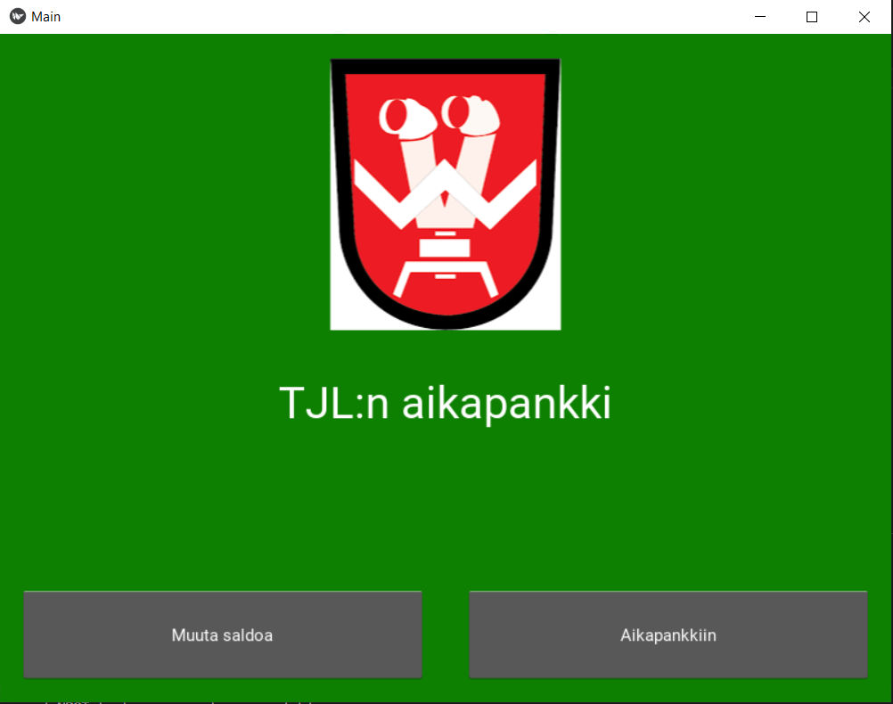
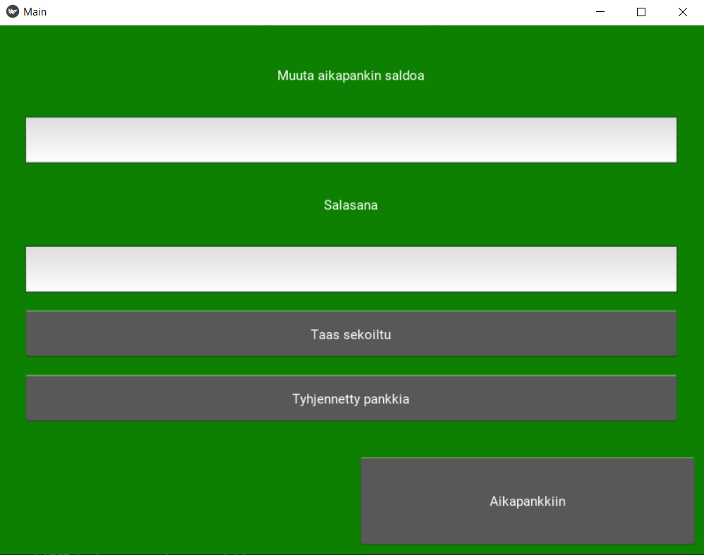
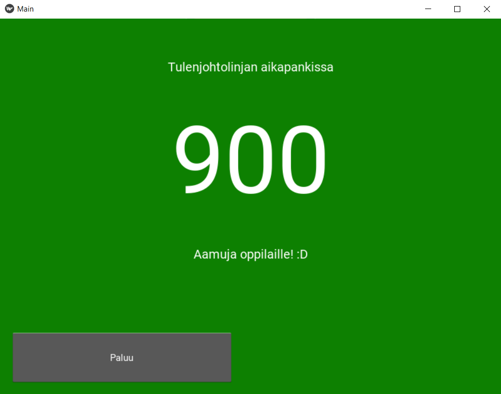

# Aikapankki

Ohjelma on tehty armeija-aikana Kivy-harjoituksena pitämään kirjaa AUK-oppilaiden liikuntatavoitteesta. Aikapankki oli kouluttajien kehittämä menetelmä, joka perustui siihen, että oppilaiden myöhästyessä siihen kertyi saldoa, jota tyhjennettiin liikuntasuoritteilla.  

Ohjelma vaatii Kivy-kirjaston ja käynnistyy ajamalla main.py :n 

Saldon muokkauksessa ylempään syöttökenttään laitetaan kokonaisluku ja alempaan salasana.

Salasana: Jomppa

